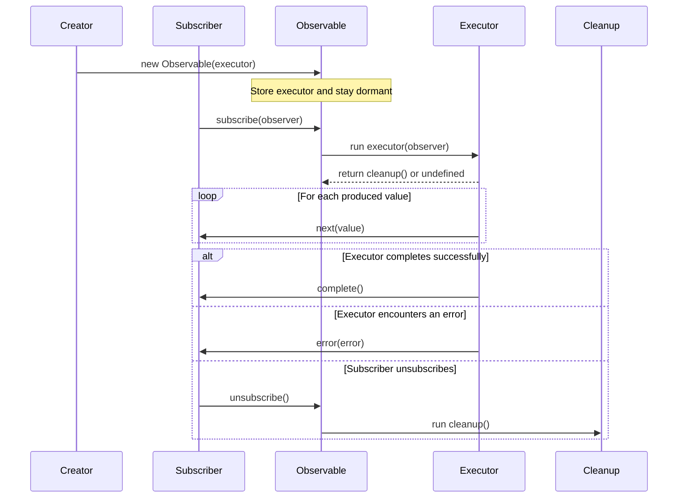

# Observable

Observable is an object that can produce value if and only if someone subscribes to it. Every subscriber will receive a fresh value when they subscribe to an Observable. To put it in other words, an observable will run value generation logic whenever someone subscribes.

Observable can be expressed as:

```typescript
class Observable<T> {
  constructor(executor: ExecutorFunc) {}
  subscribe(observer: Observer<T>): UnsubscribeFunc;
}
```

Observers take an executor function or value generation function as their argument to their constructor. This executor function looks like:

```typescript
type ExecutorFunc<T> = (observer: Observer<T>) => CleanupFunc | undefined;
```

Executor function can return an optional Cleanup function.

```typescript
type Cleanup = () => void;
```

Usually subscribers will have a very simple interface

```typescript
interface Observer<T> {
  next(value: T): void;
  complete(): void;
  error(error: Error): void;
}
```

## Interaction

First we need to create an observalbe by passing it an executor function.

Observable simply stores this executor function in a member variable. And then goes dormant.

As a rule of thumb, an observable will produce value only when someone subscribes.

As soon as an observer subscribes, the Observable will run the executor function. The executor function will notify values via subscriber's next method. Once it is done with producing values it will call subscriber's 'complete' method. In case there was an error while running executor logic, it will notfiy using 'error' method.



## Typical implementation

```typescript
type CleanupFunction = () => void;

type Executor<T> = (observer: Observer<T>) => CleanupFunction | void;

interface Subscription {
  unsubscribe(): void;
}

class Observable<T> {
  private executor: Executor<T>;

  constructor(executor: Executor<T>) {
    this.executor = executor;
  }

  subscribe(observer: Observer<T>): Subscription {
    const cleanup = this.executor(observer);
    return {
      unsubscribe: () => cleanup?.(),
    };
  }
}

interface Observer<T> {
  next(value: T): void;
  error(err: any): void;
  complete(): void;
}

export {
  Observable,
  type Observer,
  type CleanupFunction,
  type Executor,
  type Subscription,
};
```
