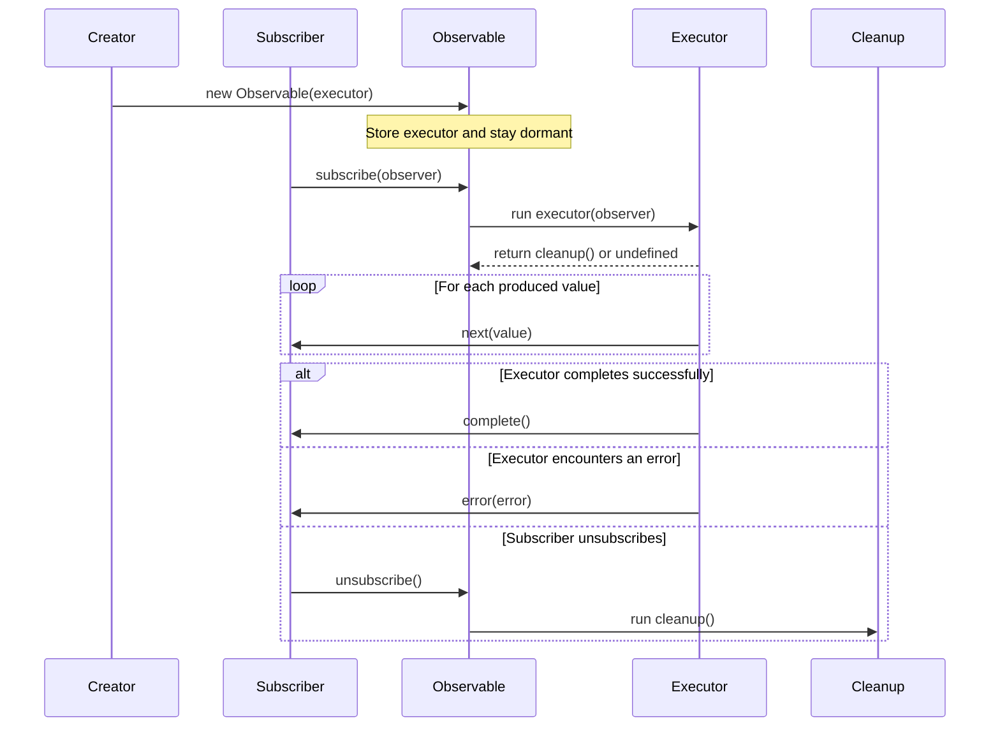

# Observable

Observable is an object that can produce value if and only if someone subscribes to it. Every subscriber will receive a fresh value when they subscribe to an Observable. To put it in other words, an observable will run value generation logic whenever someone subscribes.

Observable can be expressed as:

```typescript
class Observable<T> {
  constructor(executor: ExecutorFunc) {}
  subscribe(observer: Observer<T>): Subscription;
}
```

Observers take an executor function or value generation function as their argument to their constructor. This executor function looks like:

```typescript
type ExecutorFunc<T> = (observer: Observer<T>) => CleanupFunc | undefined;
```

Executor function can return an optional Cleanup function.

```typescript
type Cleanup = () => void;
```

Usually subscribers will have a very simple interface

```typescript
interface Observer<T> {
  next(value: T): void;
  complete(): void;
  error(error: Error): void;
}
```

## Interaction

First we need to create an observalbe by passing it an executor function.

Observable simply stores this executor function in a member variable. And then goes dormant.

As a rule of thumb, an observable will produce value only when someone subscribes.

As soon as an observer subscribes, the Observable will run the executor function. The executor function will notify values via subscriber's next method. Once it is done with producing values it will call subscriber's 'complete' method. In case there was an error while running executor logic, it will notfiy using 'error' method.



## Typical implementation

```typescript
type CleanupFunction = () => void;

type Executor<T> = (observer: Observer<T>) => CleanupFunction | void;

interface Subscription {
  unsubscribe(): void;
}

class Observable<T> {
  private executor: Executor<T>;

  constructor(executor: Executor<T>) {
    this.executor = executor;
  }

  subscribe(observer: Observer<T>): Subscription {
    const cleanup = this.executor(observer);
    return {
      unsubscribe: () => cleanup?.(),
    };
  }
}

interface Observer<T> {
  next(value: T): void;
  error(err: any): void;
  complete(): void;
}

export {
  Observable,
  type Observer,
  type CleanupFunction,
  type Executor,
  type Subscription,
};
```

## Comparison with the Promise API

We can observe that even Promise also takes an executor function as an argument to its constructor. The success/failure are conveyed via the resolve and reject functions. Promise's executor runs only once and soon as the promise is created. After this, any number of times, someone can read the resolved or reject values via either classic then..catch chain or the modern async..await mechanism.

Observable also looks similar but with few distinction. The value is generated only when someone really subscribes to it. And observers can generate multiple values over time until they flag that their value generation is completed, or there are no longer active subscribers to it.

<table>
  <thead>
    <tr>
      <th>Aspect</th>
      <th>Observable</th>
      <th>Promise</th>
    </tr>
  </thead>
  <tbody>
    <tr>
      <td><strong>Execution model</strong></td>
      <td>Lazy. Nothing happens until a subscriber calls <code>subscribe()</code>.</td>
      <td>Eager. The executor runs immediately when the promise is created.</td>
    </tr>
    <tr>
      <td><strong>Values produced</strong></td>
      <td>Can emit zero, one, or many values over time.</td>
      <td>Resolves or rejects exactly once.</td>
    </tr>
    <tr>
      <td><strong>Cancellation</strong></td>
      <td>Built in through <code>unsubscribe()</code> and optional cleanup logic.</td>
      <td>No built-in cancellation in the core API.</td>
    </tr>
    <tr>
      <td><strong>Error handling</strong></td>
      <td>Uses the observer's <code>error()</code> callback.</td>
      <td>Uses <code>reject()</code>, <code>.catch()</code>, or <code>try/catch</code> with <code>await</code>.</td>
    </tr>
    <tr>
      <td><strong>Completion</strong></td>
      <td>Can explicitly signal completion with <code>complete()</code>.</td>
      <td>Completes implicitly after resolve or reject.</td>
    </tr>
    <tr>
      <td><strong>Multiple consumers</strong></td>
      <td>Each subscription can start a fresh execution.</td>
      <td>All consumers observe the same settled result.</td>
    </tr>
    <tr>
      <td><strong>Best fit</strong></td>
      <td>Event streams, intervals, UI interactions, and any async source with repeated values.</td>
      <td>One-off async work such as a single request or a one-time computation.</td>
    </tr>
  </tbody>
</table>

In short, a Promise models one future result, while an Observable models a stream of results over time.
